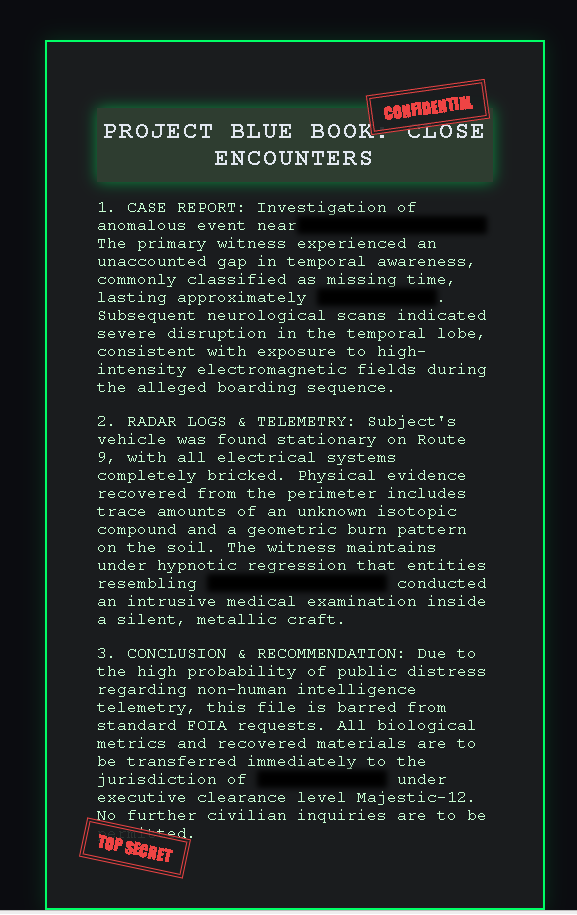

# 📁 Project Blue Book: Close Encounters 

An interactive, responsive confidential email interface inspired by retro-cyberpunk terminals, tactical classified military logs (FOIA / Epstein Files), and the psychological tech atmosphere of *Serial Experiments Lain*.

This project was built as a core lab requirement for the **freeCodeCamp Responsive Web Design Certification**.

---

## 🛸 Project Overview

The objective was to create a secure, authenticated-looking layout for a restricted military document regarding Close Encounters of the Fourth Kind (non-human intelligence telemetry and biological asset management). 

To respect strict structural constraints while delivering a high-quality user experience, the system implements standard document containment, text redaction filters, and certified compliance stamps.

## 📷 Preview

### Key Technical Achievements:
* **True Box-Sizing Integration:** Ensured layout stability across test metrics by anchoring container calculation to `border-box`.
* **Centering Matrix:** Utilized modern CSS Flexbox on the parent scope (`body`) combined with viewport metrics (`100vh`) to achieve seamless geometric alignment.
* **Redaction Masking:** Replicated military-grade black-marker redaction using a dual CSS filter layer (`blur(3px)`) layered with solid hexadecimal ink masks.

---

## 🛠️ User Stories & Compliance

The layout successfully fulfills 100% of the automated freeCodeCamp test specifications:
1. `main` semantic block anchored to `#email`.
2. Strict structural padding (`50px`) and margin boundaries.
3. Encapsulated `#confidential` and `#top-secret` identifiers set to `inline-block` flow.
4. CSS Transformation matrix utilized for stamp orientation angles (`rotate()`).
5. Multi-paragraph structure with nested `.blurred` classification elements.

---

## 🎨 Design System

* **Terminal Matrix (Background):** `#0b0c10` (Abyssal Void)
* **Report Chassis:** `#1a1c1e` (Tactical Metallic Gray)
* **Phosphor Text:** `#c8ffd4` (Vintage Monitor Emulation)
* **Command Header Background:** `#2e3d30` (War Room Olive)
* **Security Stamps:** `#ef4444` (Alarms & Restricted Enclosures)

---

## 🚀 How to Run the Preview Locally

1. Clone or download this repository.
2. Ensure the assets path tree is structured under the standard root `assets/` directory.
3. Open `index.html` via your browser of choice or initiate a local pipeline using the **VS Code Live Server** extension.